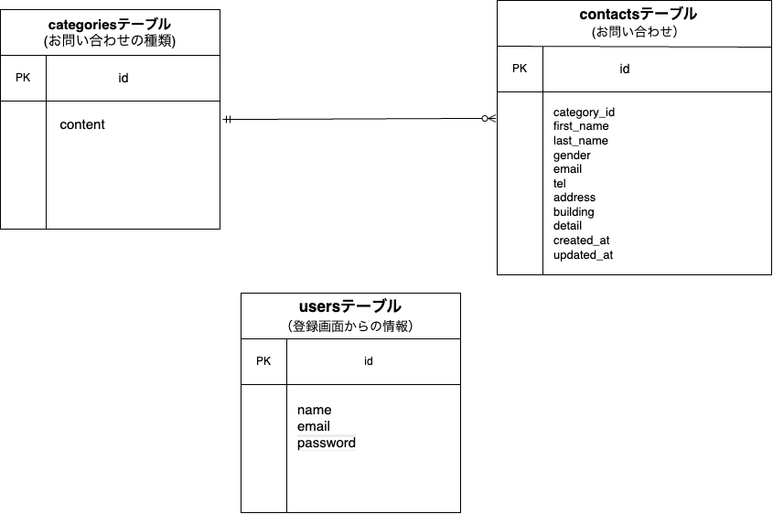

# お問い合わせフォーム

## 環境構築

### Dockerビルド

1. git clone https://github.com/morikoshi2627/contact-laravel.git  
cd contact-laravel  
2. docker-compose build  
   docker-compose up -d  
3. docker-compose exec php bash

### Laravel環境構築

1. composer install  
2. cp .env.example .env  
   php artisan key:generate  
3. .envのDB設定を以下のように修正  
    DB_CONNECTION=mysql  
    DB_HOST=mysql  
    DB_PORT=3306  
    DB_DATABASE=laravel_db  
    DB_USERNAME=laravel_user  
    DB_PASSWORD=laravel_pass  
4. php artisan migrate --seed  
5. ・アプリURL: http://localhost  
   ・phpMyAdmin: http://localhost:8080（ユーザー: laravel_user, パスワード:laravel_pass）

## 使用技術

- PHP 7.4.9-fpm
- Laravel 8.x
- MySQL 8.0.26
- Docker / Docker Compose

## ER図

## URL

開発環境：http://localhost/